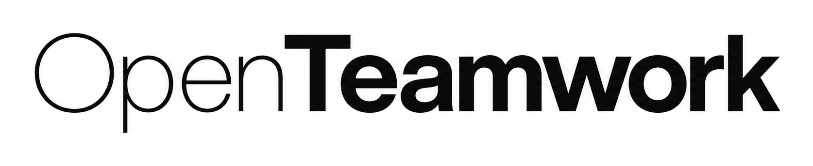
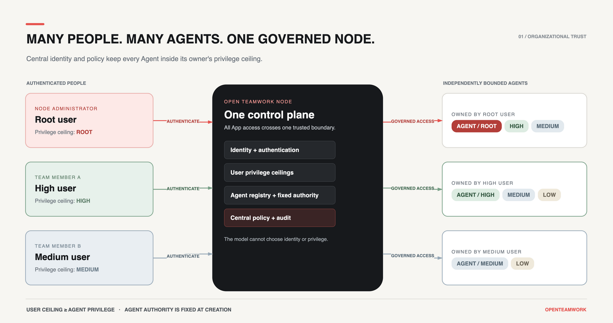
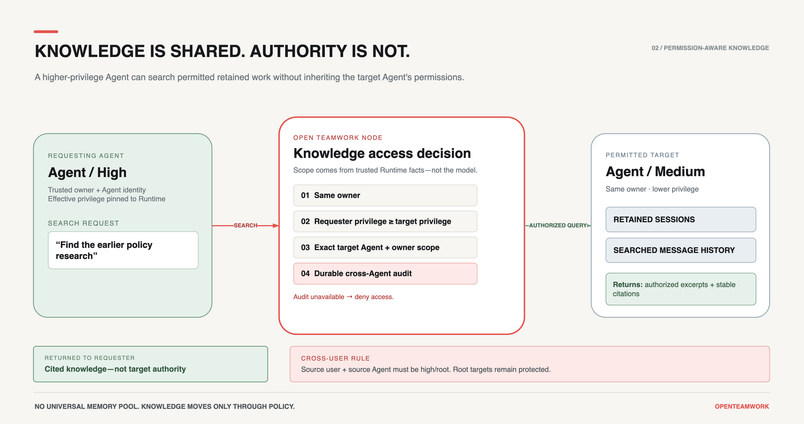
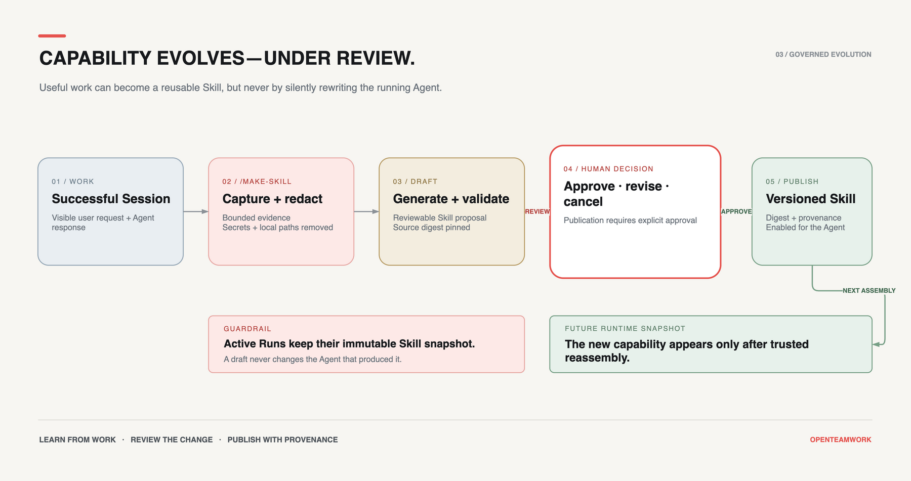
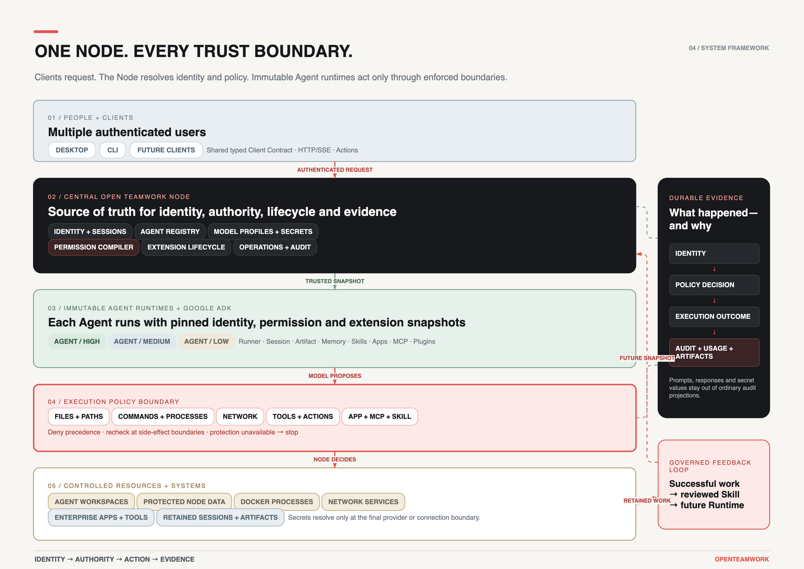

<h1 align="center">
  
</h1>

<p align="center">
  <strong>English</strong> · <a href="./README.zh-CN.md">简体中文</a>
</p>

<p align="center">
  <strong>Bring AI agents into your organization—without losing control of information or access.</strong>
</p>

<p align="center">
  OpenTeamwork is a self-hosted Agent platform for organizations.<br>
  One trusted Node governs identities, model access, execution permissions, shared knowledge,<br>
  Token usage, and audit.
</p>

<p align="center">
  <a href="#quick-start">Quick Start</a> ·
  <a href="#why-openteamwork">Why OpenTeamwork</a> ·
  <a href="#security-model">Security</a> ·
  <a href="./docs/README.md">Documentation</a> ·
  <a href="https://github.com/GML-FMGroup/openteamwork/releases/tag/v0.6.1">Latest Preview</a>
</p>

<p align="center">
  
  
  
  <a href="./LICENSE"></a>
</p>

> [!WARNING]
> OpenTeamwork is a **Developer Preview**, not yet production-ready. The packaged Desktop currently supports Apple silicon Macs only and is unsigned and not notarized. Review the [current boundaries](#project-status-and-boundaries) before connecting it to sensitive systems.

<a id="why-openteamwork"></a>

## Work needs more than a personal assistant

Personal assistants work well when one person controls the credentials, memory, and access. But that default trust model does not transfer safely into organizational work. It can mix personal and work context, expose sensitive information beyond its intended audience, or let an Agent reach files, Tools, and systems the task never needed.

An organization has many users, many Agents, shared knowledge, sensitive systems, and different levels of authority. The question is no longer only whether an Agent *can* complete a task, but:

> **Should this Agent, acting within this user's authority, be allowed to perform this action on this resource?**

OpenTeamwork puts that decision outside the model and its Prompt. The model proposes; the Node evaluates trusted identity and policy, enforces the result where actions happen, and records durable evidence. What happened—and why it was allowed—no longer has to be inferred from the Agent's answer.

```text
Trusted identity  →  bounded authority  →  governed action  →  durable evidence
```

OpenTeamwork is an independently developed Agent platform, built from the ground up for organizational work. Agent capability, identity, permission boundaries, knowledge sharing, extension governance, and audit have been designed as one system from the beginning.



## Control built into every layer

### Manage model access, Token usage, and audit in one place

Administrators configure approved Model Profiles and protected provider credentials once at the Node. Authorized users and Agents can use those models without receiving the underlying API keys.

- The Node records provider, model, Session, invocation, input/output Tokens, text/image Token detail, duration, and time to first Token.
- Operators can inspect aggregate usage and recent calls, with optional provider filtering.
- Redacted Action audit separately records the actor, Agent, policy decision, target, outcome, and timestamps.
- Credentials, prompts, model responses, request bodies, and response bodies are deliberately excluded from ordinary usage and audit projections.

This provides centralized access and operational visibility—not a claim of per-user billing, departmental budgets, quotas, or chargeback. See [Configuration and Model Profiles](./docs/CONFIGURATION.md) and [Node Operations](./docs/OPERATIONS.md).

### Trusted identities, clear ownership

- Node-local accounts use one-way Argon2id secret hashes and revocable App sessions.
- Users, Agents, Sessions, Runs, Automations, and Artifacts have trusted server-side identity and ownership.
- A client cannot choose another user's identity by changing a request field.
- Ordinary users see only their authorized resources; root administration remains a separate boundary.
- Users can create Agents only at or below their own `low < medium < high < root` privilege ceiling.
- Each user may create multiple Agents with different privilege levels; each Agent keeps its own Workspace, Sessions, and trusted Runtime identity.

### Each Agent gets only the authority it needs

A powerful user does not require an all-powerful Agent. User privilege controls the maximum Agent authority that person may create. Agent privilege controls what the resulting Runtime may actually do. Node hard rules and Agent-specific rules narrow that authority further, with deny precedence.

```text
Authenticated user
      ∩ user privilege ceiling
      ∩ Agent privilege
      ∩ Node hard rules
      ∩ Agent-specific permissions
      = effective authority for this action
```

Permission decisions are compiled into content-addressed snapshots. The model cannot select its own privilege level, and changing a prompt does not change the trusted execution identity. An Agent's owner, Workspace, privilege, controls, and Agent-specific permissions are fixed after creation; presentation, instruction, and model selection can evolve without silently widening authority.

### Enforce permissions where actions happen

OpenTeamwork authorizes execution surfaces, not just UI screens:

- the Agent's own Workspace;
- external files and folders;
- file read, write, and execute operations;
- Commands and Processes;
- Network destinations and redirects;
- built-in Tools and typed Actions;
- App, MCP, Plugin, and Skill capabilities.

Rules can match paths, Agent Workspace ownership, command profiles, process provenance, network targets, stable Tool IDs, timeouts, output limits, and other adapter-enforced constraints.

```text
Reporting Agent
├── Read       approved project folders
├── Write      its own Workspace
├── Use        spreadsheet and reporting Tools
├── Connect    approved public endpoints
└── Deny       Node data, other Agent Workspaces, and host execution
```

See [Static execution permissions](./docs/PERMISSIONS.md) for the full matrix and rule semantics.

### Share knowledge without making everything public

Authorized Agents can list, search, and read retained work across permitted Agents and users. Access is calculated from trusted user identity, Agent identity, and effective Agent privilege—not from model-supplied scope.

- Every Agent can search its own retained Sessions.
- Cross-Agent and cross-user access follows explicit privilege rules.
- Root-user and root-Agent history remains protected from ordinary organizational search.
- Results include stable Agent, owner, Session, and message citations.
- Historical content is treated as quoted, untrusted data rather than new instructions.
- Cross-Agent access writes a durable audit record and fails closed if that audit cannot be persisted.

Knowledge is shared according to policy; it is not copied into a global memory that every Agent can read. See [Historical Session Access](./docs/SESSION_HISTORY.md).



### Extend capabilities without bypassing governance

OpenTeamwork supports four extension types:

- **Skill:** instructions, references, and controlled scripts;
- **App:** a managed external-service integration with authorization and Tool policy;
- **MCP:** a directly managed local or remote Model Context Protocol server;
- **Plugin:** a portable bundle that can provide Skills, Apps, MCP templates, Agent templates, schemas, and documentation.

Discovering an extension does not make it trusted, installed, enabled, or available to every Agent. Extension mutations follow a governed lifecycle:

```text
discover → stage → validate → preview → confirm → install → enable → test
```

Sources, paths, archives, digests, dependencies, SecretRefs, Tool prefixes, risk, and Agent enablement are validated before Runtime assembly. Active Runs keep an immutable extension snapshot; updates affect future Runtime instances instead of silently changing work in progress.

OpenTeamwork can also turn a useful conversation into a reviewable Skill draft with `/make-skill`. The authoring boundary captures only visible Session evidence, redacts common secrets and local paths, pins source provenance, validates the generated document, and supports approve, revise, or cancel. Publication requires explicit approval; a published Skill enters a future immutable Runtime snapshot instead of rewriting an active Run.



See [Extension and MCP Security](./docs/MCP_SECURITY.md).

### If protection is unavailable, execution stops

- Non-root Command execution requires a permission-derived Docker sandbox.
- If the required sandbox or Network boundary is unavailable, execution is denied instead of falling back to the host.
- Non-root file Tools cannot access Node configuration, credentials, databases, or another Agent's Workspace.
- Permission tightening is rechecked before the next Tool Action in a long-lived Runtime.
- Permission widening requires a fresh trusted Runtime assembly.
- Secret values are resolved only at the final provider or connection boundary and are excluded from ordinary resources, diagnostics, audit payloads, and client responses.

Isolation is defense in depth, not a reason to trust unknown code. Local extensions and Docker-daemon access still require operator review.

### Keep evidence, not just answers

OpenTeamwork keeps work as Node-owned facts rather than inferring completion from a confident final message:

- persistent Google ADK Sessions, Artifacts, and Memory;
- TaskRuns, TaskEvents, tool calls, checkpoints, and workflow facts;
- durable Goals and TaskFlows with completion evidence;
- scheduled and event-driven Automations, Cron, and Heartbeat;
- streaming Runs with bounded reconnect and SSE replay;
- health, usage, diagnostics, and redacted Action audit.

Documents, spreadsheets, PDFs, presentations, text/code, and images can enter a Session as validated Artifacts. Original bytes remain downloadable while bounded, deterministic projections are supplied to the model. See [Sessions, Attachments, and Artifacts](./docs/ARTIFACTS.md).

## Quick Start

### Requirements

- Python 3.14 for the documented and tested source-development path;
- Node.js and pnpm for Desktop development;
- a supported model provider account or local model endpoint;
- Docker when a non-root Agent needs Command execution.

### 1. Install from source

```bash
git clone https://github.com/GML-FMGroup/openteamwork.git
cd openteamwork
python3.14 -m venv .venv
source .venv/bin/activate
python -m pip install -e .
```

For an offline checkout whose build dependencies are already installed:

```bash
python -m pip install --no-build-isolation -e .
```

### 2. Initialize the Node

`otw setup` initializes the Node without asking for an LLM credential or creating an Agent:

```bash
otw setup \
  --listen-host 127.0.0.1 \
  --listen-port 18765 \
  --authentication required
```

Create the first root account, set one persistent deployment token, and start the Node:

```bash
otw user add admin@example.com --privilege root
export OPENTEAMWORK_CLIENT_API_TOKEN='<persistent-strong-random-token>'
otw node run
```

`otw user add` collects the account secret through a hidden prompt. Ordinary Desktop users sign in with their own account secret and receive a revocable App session; they do not receive the deployment bearer token.

### 3. Start Desktop

In another terminal, from the repository root:

```bash
pnpm install
pnpm desktop:dev
```

Sign in as the root user, configure a Model Profile and protected provider credential, create the first Agent, and complete the verified first Hello.

The default local endpoint is `http://127.0.0.1:18765`. See [OpenTeamwork Desktop](./apps/desktop/README.md) for local Node supervision, packaging, and remote connection instructions.

### Packaged preview

[OpenTeamwork v0.6.1](https://github.com/GML-FMGroup/openteamwork/releases/tag/v0.6.1) provides a Python wheel and an unsigned macOS Apple Silicon Desktop preview with SHA-256 checksums. The Desktop is a thin client: it does not contain Python, the Node, model credentials, or user databases.

## Architecture



The Node is the source of truth. Desktop and CLI use the same typed application boundary; clients do not read or rewrite Node business files. This keeps identity, policy, audit, and lifecycle behavior consistent across interactive clients, slash commands, automation, and future integrations.

OpenTeamwork uses Google ADK's Agent, Runner, Session, Artifact, Memory, MCP, Plugin, rewind, compaction, resumability, and evaluation boundaries instead of building a parallel Agent loop.

See [Project Architecture](./docs/PROJECT_OVERVIEW.md) and the [Client API contract](./contracts/client-api/README.md).

## Security model

OpenTeamwork uses defense in depth across identity, policy, Runtime assembly, and the actual execution adapters:

1. The Node authenticates the caller and resolves server-trusted identity.
2. User privilege limits which Agents and administrative resources the caller may control.
3. Agent privilege, Node hard rules, and Agent rules compile into an immutable baseline.
4. Tool, Path, Command, Process, and Network adapters authorize trusted Runtime facts at the side-effect boundary.
5. High-risk Actions require policy permission, confirmation, and durable audit start.
6. Secrets remain references until the final SDK or connection boundary.

For remote Desktop access, keep the Python Client API on loopback and expose it only through a same-host HTTPS reverse proxy. Do not expose the Client API port directly to a LAN or the public internet.

Read the operational details before granting real authority:

- [Static execution permissions](./docs/PERMISSIONS.md)
- [Extension and MCP security](./docs/MCP_SECURITY.md)
- [Docker sandbox and Network policy](./docs/SANDBOX.md)
- [Users and remote App access](./docs/USERS.md)

## CLI and operations

`otw` is the documented command; `openteamwork` is an equivalent long-form entry point.

```text
otw status
otw setup
otw user add|list|disable
otw node run|service
otw action list|invoke
otw command
otw config read|validate|preview|apply
otw model list|read|readiness|select|apply
otw extension list|get|readiness|preview|install|enable|disable|remove
otw operations status|health|tasks|cron|heartbeat|usage|audit
```

Commands that manage a running Node accept `--url` and `--token`. Add `--json` for machine-readable output. Use `otw <group> --help` for exact inputs and optimistic-revision requirements.

Slash commands are projections of the same typed Action catalog:

```bash
otw command '/status'
otw command '/skills' --agent main
otw command '/history' --agent main --session <session-id>
```

## Repository layout

```text
openppx/                    Python Node, domains, Runtime, and built-in Skills
packages/client/            Shared TypeScript Client Contract implementation
apps/desktop/               Electron/React Desktop
contracts/client-api/       Versioned schemas, protocol notes, and fixtures
tests/                      Unit, integration, contract, architecture, and eval tests
docs/                       User, security, architecture, and operator documentation
```

## Development and verification

Run the canonical offline-friendly verification gate from the repository root:

```bash
./.venv/bin/python scripts/verify.py
```

It verifies Python, the TypeScript Client, Desktop, Electron preload, strict types, and production builds. Before producing the macOS Apple Silicon preview artifact, include the package checks:

```bash
./.venv/bin/python scripts/verify.py --package
```

Use `--list`, `--skip-python`, or `--skip-build` only for diagnostics; the complete gate remains the acceptance source of truth.

## Documentation

- [Documentation index](./docs/README.md)
- [Project architecture](./docs/PROJECT_OVERVIEW.md)
- [Configuration and Model Profiles](./docs/CONFIGURATION.md)
- [Static execution permissions](./docs/PERMISSIONS.md)
- [Historical Session access](./docs/SESSION_HISTORY.md)
- [Sessions, attachments, and Artifacts](./docs/ARTIFACTS.md)
- [Node operations](./docs/OPERATIONS.md)
- [Users and remote App access](./docs/USERS.md)
- [Extension and MCP security](./docs/MCP_SECURITY.md)
- [Office connectors](./docs/OFFICE_CONNECTORS.md)
- [Sandbox](./docs/SANDBOX.md)
- [Use cases](./docs/USE_CASES.md)

<a id="project-status-and-boundaries"></a>

## Developer Preview: current capabilities and boundaries

The latest published version is [v0.6.1 Secure Multi-User History Preview](./docs/releases/v0.6.1.md).

- CLI and Desktop are the current first-class clients. A mobile client is future work.
- The packaged Desktop preview currently targets macOS Apple Silicon and is unsigned and not notarized.
- Remote access requires administrator-provided HTTPS termination; automatic certificates, discovery, SSO, password reset, and a public relay are not implemented.
- Permission-aware organizational history is implemented. Owner/participant access and member-scoped Agent Memory foundations exist in the current source, while a complete shared-Agent Desktop workflow is still under active development.
- Message attachments support modern DOCX, XLSX, CSV, text-based PDF, PPTX, PNG, JPEG, WebP, and a bounded set of UTF-8 text/code formats. Legacy Office formats, scanned-PDF OCR, encrypted PDFs, and arbitrary binary files are deliberately rejected.
- Public extension catalogs, hosted operation, and deeper long-task intelligence remain future product layers.
- Docker isolation does not make an unknown extension safe, and Docker daemon access remains host-powerful.

## Contributing

Bug reports, design feedback, documentation improvements, tests, integrations, and focused pull requests are welcome. For a substantial change, please [open an issue](https://github.com/GML-FMGroup/openteamwork/issues) first so the permission, product, and Google ADK boundaries can be agreed before implementation.

If OpenTeamwork's organization-first direction is useful to you:

- ⭐ **Star the repository** so more builders can discover it;
- share the project with teams exploring self-hosted Agents;
- try the Developer Preview and report the rough edges;
- contribute a reproducible test, security review, integration, or documentation improvement.

## License

OpenTeamwork is open source under the [Apache License 2.0](./LICENSE).
