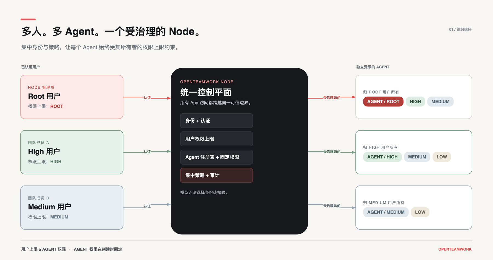
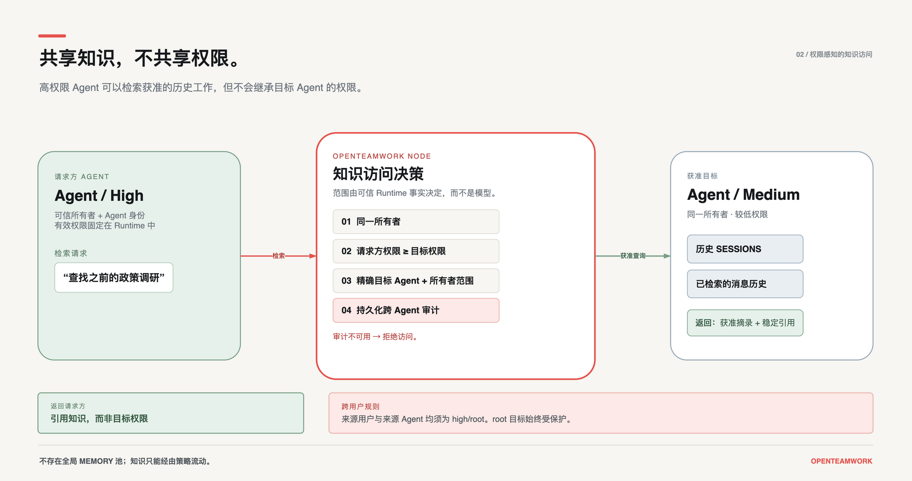
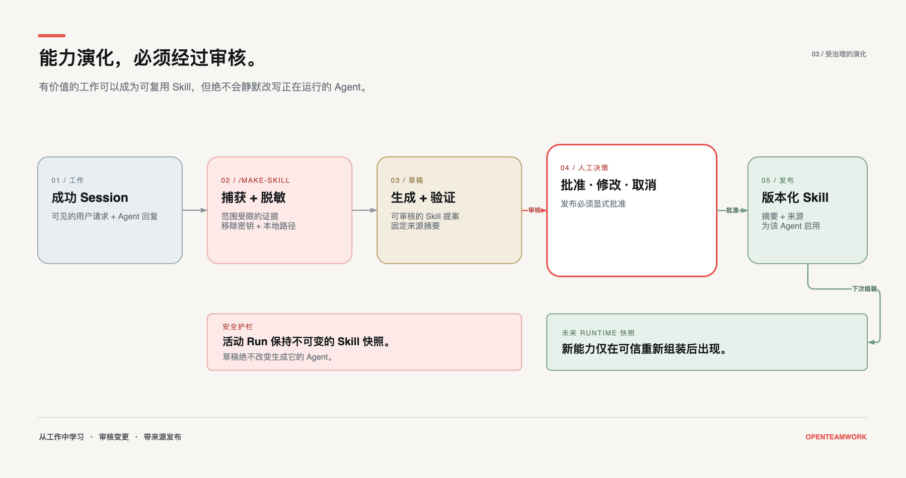
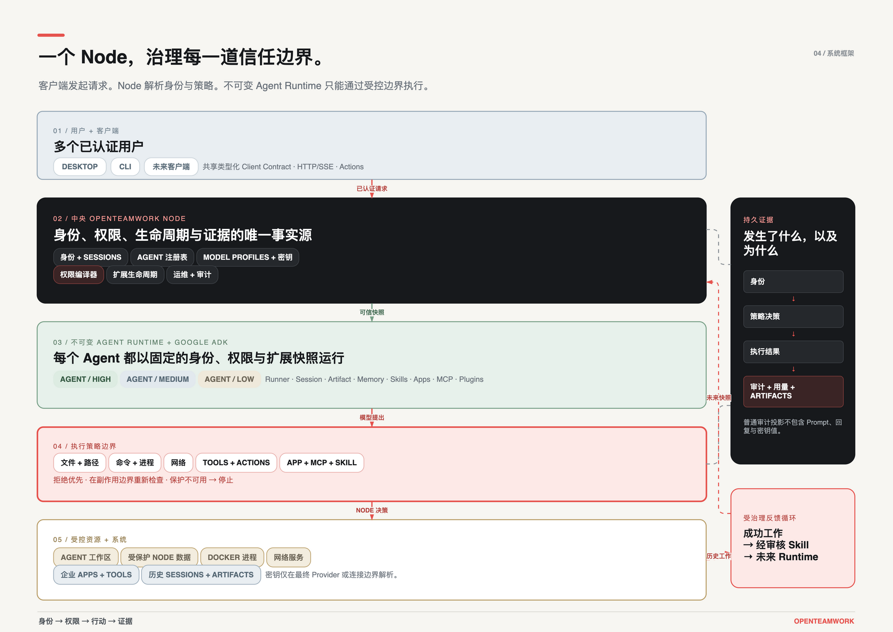

<h1 align="center">
  
</h1>

<p align="center">
  <a href="./README.md">English</a> · <strong>简体中文</strong>
</p>

<p align="center">
  <strong>让 AI Agent 参与组织工作，同时守住信息与访问边界。</strong>
</p>

<p align="center">
  OpenTeamwork 是面向组织的自托管 Agent 平台。<br>
  一个可信 Node 统一管理身份、模型访问、执行权限、共享知识、<br>
  Token 用量与操作审计。
</p>

<p align="center">
  <a href="#quick-start">快速开始</a> ·
  <a href="#why-openteamwork">为什么选择 OpenTeamwork</a> ·
  <a href="#security-model">安全模型</a> ·
  <a href="./docs/README.md">文档</a> ·
  <a href="https://github.com/GML-FMGroup/openteamwork/releases/tag/v0.6.1">最新预览版</a>
</p>

<p align="center">
  
  
  
  <a href="./LICENSE"></a>
</p>

> [!WARNING]
> OpenTeamwork 目前是**开发者预览版**，尚未达到生产就绪状态。打包的 Desktop 当前仅支持搭载 Apple 芯片的 Mac，并且尚未签名和公证。接入敏感系统前，请先阅读[当前状态与边界](#project-status-and-boundaries)。

<a id="why-openteamwork"></a>

## 工作场景需要的不只是个人助手

个人助手很适合由一个人掌控凭据、记忆和访问范围的场景。但这套默认信任模型不能安全地直接搬进组织：个人上下文与工作信息可能混在一起，敏感内容可能越过应有的可见范围，Agent 也可能访问当前任务并不需要的文件、Tool 或系统。

组织中有多位用户、多个 Agent、共享知识、敏感系统，以及不同级别的权限。问题不再只是“Agent 能不能完成任务”，还包括：

> **这个 Agent 在当前用户的权限范围内，是否应该被允许对这个资源执行这项操作？**

OpenTeamwork 把这个决定放在模型和 Prompt 之外。模型提出行动；Node 根据可信身份和权限策略做出判断，在操作发生的地方执行约束，并留下持久证据。发生了什么、为什么被允许，不再需要从 Agent 的回答中推断。

```text
可信身份  →  权限边界  →  受控行动  →  持久证据
```

OpenTeamwork 是一个从零开始、面向组织工作独立研发的 Agent 平台。Agent 能力、身份、权限边界、知识共享、扩展治理与审计从一开始就是同一套系统的一部分。



## 把控制内置到每一层

### 模型访问、Token 用量与审计统一管理

管理员只需在 Node 上集中配置获准使用的 Model Profile 和受保护的模型服务商凭据。获得授权的用户与 Agent 可以使用这些模型，却不会拿到背后的 API Key。

- Node 记录 provider、model、Session、invocation、输入/输出 Token、文本/图像 Token、耗时和首 Token 延迟（TTFT）。
- 运维人员可以查看汇总用量与最近调用，并按模型服务商进行过滤。
- 脱敏的 Action 审计单独记录操作者、Agent、策略决定、目标、结果与时间戳。
- 凭据、Prompt、模型回复、请求正文和响应正文不会进入普通用量与审计视图。

这提供的是集中访问控制和运营可见性，并不代表当前已经支持按用户计费、部门预算、额度限制或成本分摊。详见[配置与 Model Profile](./docs/CONFIGURATION.md)和 [Node 运维](./docs/OPERATIONS.md)。

### 可信身份，清晰归属

- Node 本地账号使用单向 Argon2id 密码哈希与可撤销的 App Session。
- 用户、Agent、Session、Run、Automation 和 Artifact 都拥有由服务端信任的身份与归属信息。
- 客户端不能通过修改请求字段来冒用其他用户身份。
- 普通用户只能看到自己有权访问的资源；root 管理边界保持独立。
- 用户只能创建不高于自身 `low < medium < high < root` 权限上限的 Agent。
- 每位用户都可以创建多个不同权限级别的 Agent；每个 Agent 拥有独立的 Workspace、Session 与可信 Runtime 身份。

### 每个 Agent 只获得所需权限

高权限用户并不意味着必须使用一个拥有全部权限的 Agent。用户权限决定其能够创建的 Agent 权限上限，Agent 权限决定 Runtime 实际可以执行什么；Node 强制规则和 Agent 专属规则还会进一步收窄权限，并且拒绝规则优先。

```text
已认证用户
      ∩ 用户权限上限
      ∩ Agent 权限级别
      ∩ Node 强制规则
      ∩ Agent 专属权限
      = 本次操作的有效权限
```

权限决定会被编译为内容寻址的快照。模型不能选择自己的权限级别，修改 Prompt 也不会改变可信的执行身份。Agent 的所有者、Workspace、权限级别、控制项和 Agent 专属权限在创建后保持固定；名称、指令和模型选择可以继续调整，却不能借此悄悄扩大权限。

### 在操作发生的地方校验权限

OpenTeamwork 授权的是实际执行面，而不只是界面入口：

- Agent 自己的 Workspace；
- 外部文件与文件夹；
- 文件读取、写入与执行；
- Command 与 Process；
- Network 目标与重定向；
- 内置 Tool 与类型化 Action；
- App、MCP、Plugin 和 Skill 能力。

规则可以匹配路径、Agent Workspace 归属、命令配置、进程来源、网络目标、稳定 Tool ID、超时、输出限制，以及由适配器强制执行的其他约束。

```text
报告 Agent
├── 读取      获准的项目文件夹
├── 写入      自己的 Workspace
├── 使用      表格与报告工具
├── 连接      获准的公网目标
└── 拒绝      Node 数据、其他 Agent Workspace 和宿主机执行
```

完整权限矩阵与规则语义请参阅[静态执行权限](./docs/PERMISSIONS.md)。

### 共享知识，不等于公开一切

获得授权的 Agent 可以列出、搜索和读取允许范围内其他 Agent 与用户保留的工作记录。访问范围由可信的用户身份、Agent 身份与 Agent 有效权限共同计算，而不是由模型自己声明。

- 每个 Agent 都可以搜索自己的历史 Session。
- 跨 Agent、跨用户访问遵循明确的权限规则。
- root 用户和 root Agent 的历史不会进入普通组织搜索范围。
- 搜索结果包含稳定的 Agent、所有者、Session 和消息引用。
- 历史内容会被视为引用的、不可信的数据，而不是新的指令。
- 跨 Agent 访问会写入持久审计；如果审计无法持久化，访问将失败关闭。

知识按照权限策略共享，而不是被复制到一个所有 Agent 都可读取的全局 Memory 中。详见[历史 Session 访问](./docs/SESSION_HISTORY.md)。



### 扩展能力，不绕过治理

OpenTeamwork 支持四类扩展：

- **Skill：**指令、参考资料与受控脚本；
- **App：**带有授权与 Tool 策略的受管外部服务集成；
- **MCP：**直接管理的本地或远程 Model Context Protocol Server；
- **Plugin：**可以提供 Skill、App、MCP 模板、Agent 模板、Schema 和文档的可移植扩展包。

发现一个扩展，不代表它已经可信、安装、启用，或可以被每个 Agent 使用。扩展变更遵循受治理的生命周期：

```text
发现 → 暂存 → 校验 → 预览 → 确认 → 安装 → 启用 → 测试
```

在 Runtime 组装前，系统会校验来源、路径、归档、摘要、依赖、SecretRef、Tool 前缀、风险和 Agent 启用范围。正在运行的 Run 会固定不可变的扩展快照；更新只影响未来组装的 Runtime，不会悄悄改变进行中的工作。

OpenTeamwork 还可以通过 `/make-skill` 将一次有价值的对话生成可审查的 Skill 草稿。能力创作边界只捕获当前可见的 Session 证据，对常见 Secret 与本地路径进行脱敏，固定来源记录并校验生成的文档，同时支持批准、修改或取消。发布必须得到明确批准；新 Skill 会进入未来的不可变 Runtime 快照，而不会改写正在运行的 Run。



详见[扩展与 MCP 安全](./docs/MCP_SECURITY.md)。

### 安全边界不可用，就不执行

- 非 root Agent 执行 Command 时必须使用根据权限生成的 Docker Sandbox。
- 如果必需的 Sandbox 或 Network 边界不可用，系统会拒绝执行，而不是退回宿主机运行。
- 非 root 文件 Tool 不能访问 Node 配置、凭据、数据库或其他 Agent 的 Workspace。
- 长期运行的 Runtime 会在下一次 Tool Action 前重新检查收紧后的权限。
- 放宽权限需要重新组装可信 Runtime。
- Secret 值只会在最终模型服务商或连接边界解析，并且不会进入普通资源、诊断、审计载荷和客户端响应。

隔离是纵深防御的一部分，并不代表未知代码可以被信任。本地扩展和 Docker Daemon 访问仍然需要管理员审查。

### 留下证据，而不只是一句答案

OpenTeamwork 将工作保存为 Node 所有的事实，而不是根据模型自信的最终回复判断任务是否完成：

- 持久化的 Google ADK Session、Artifact 和 Memory；
- TaskRun、TaskEvent、工具调用、Checkpoint 和工作流事实；
- 带有完成证据的持久 Goal 与 TaskFlow；
- 定时和事件驱动的 Automation、Cron 与 Heartbeat；
- 支持有界重连与 SSE 重放的流式 Run；
- 健康状态、用量、诊断和脱敏 Action 审计。

文档、表格、PDF、演示文稿、文本/代码和图片可以作为经过验证的 Artifact 进入 Session。原始文件可以继续下载，同时只向模型提供有界、确定性的内容投影。详见 [Session、附件与 Artifact](./docs/ARTIFACTS.md)。

<a id="quick-start"></a>

## 快速开始

### 环境要求

- 文档所述且经过测试的源码开发路径使用 Python 3.14；
- Desktop 开发需要 Node.js 和 pnpm；
- 一个受支持的模型服务商账号，或本地模型端点；
- 非 root Agent 需要执行 Command 时必须提供 Docker。

### 1. 从源码安装

```bash
git clone https://github.com/GML-FMGroup/openteamwork.git
cd openteamwork
python3.14 -m venv .venv
source .venv/bin/activate
python -m pip install -e .
```

如果离线检出的环境已经安装构建依赖：

```bash
python -m pip install --no-build-isolation -e .
```

### 2. 初始化 Node

`otw setup` 只初始化 Node，不会要求提供 LLM 凭据，也不会创建 Agent：

```bash
otw setup \
  --listen-host 127.0.0.1 \
  --listen-port 18765 \
  --authentication required
```

创建第一个 root 账号，设置一个持久的部署 Token，然后启动 Node：

```bash
otw user add admin@example.com --privilege root
export OPENTEAMWORK_CLIENT_API_TOKEN='<persistent-strong-random-token>'
otw node run
```

`otw user add` 会通过隐藏输入读取账号密码。普通 Desktop 用户使用各自的账号密码登录并获得可撤销的 App Session；他们不会得到部署 Bearer Token。

### 3. 启动 Desktop

在另一个终端中，从仓库根目录运行：

```bash
pnpm install
pnpm desktop:dev
```

以 root 用户登录，配置 Model Profile 和受保护的模型服务商凭据，创建第一个 Agent，并完成经过验证的首次 Hello。

默认本地端点为 `http://127.0.0.1:18765`。本地 Node 托管、打包和远程连接说明请参阅 [OpenTeamwork Desktop](./apps/desktop/README.md)。

### 打包预览版

[OpenTeamwork v0.6.1](https://github.com/GML-FMGroup/openteamwork/releases/tag/v0.6.1) 提供 Python Wheel，以及未签名的 macOS Apple 芯片 Desktop 预览版和 SHA-256 校验值。Desktop 是一个轻量客户端，其中不包含 Python、Node、模型凭据或用户数据库。

## 架构



Node 是系统事实来源。Desktop 与 CLI 使用相同的类型化应用边界；客户端不会直接读取或改写 Node 业务文件。因此，交互式客户端、斜杠命令、Automation 和未来集成都能共享一致的身份、策略、审计与生命周期行为。

OpenTeamwork 使用 Google ADK 原生的 Agent、Runner、Session、Artifact、Memory、MCP、Plugin、回退、上下文压缩、可恢复执行和评估边界，而不是另行构建一套平行的 Agent 循环。

详见[项目架构](./docs/PROJECT_OVERVIEW.md)和 [Client API Contract](./contracts/client-api/README.md)。

<a id="security-model"></a>

## 安全模型

OpenTeamwork 在身份、策略、Runtime 组装和实际执行适配器之间实施纵深防御：

1. Node 认证调用者并解析由服务端信任的身份。
2. 用户权限限制调用者可以控制哪些 Agent 和管理资源。
3. Agent 权限、Node 强制规则与 Agent 规则被编译为不可变的权限基线。
4. Tool、Path、Command、Process 和 Network 适配器在产生副作用的边界，根据可信 Runtime 事实执行授权。
5. 高风险 Action 需要策略许可、明确确认，并成功开始持久审计。
6. Secret 在最终 SDK 或连接边界之前始终保持为引用。

远程访问 Desktop 时，应让 Python Client API 只监听回环地址，并仅通过同一台机器上的 HTTPS 反向代理对外提供服务。不要将 Client API 端口直接暴露到局域网或公网。

授予真实权限前，请阅读以下运维文档：

- [静态执行权限](./docs/PERMISSIONS.md)
- [扩展与 MCP 安全](./docs/MCP_SECURITY.md)
- [Docker Sandbox 与 Network 策略](./docs/SANDBOX.md)
- [用户与远程 App 访问](./docs/USERS.md)

## CLI 与运维

`otw` 是文档使用的命令；`openteamwork` 是功能相同的长名称入口。

```text
otw status
otw setup
otw user add|list|disable
otw node run|service
otw action list|invoke
otw command
otw config read|validate|preview|apply
otw model list|read|readiness|select|apply
otw extension list|get|readiness|preview|install|enable|disable|remove
otw operations status|health|tasks|cron|heartbeat|usage|audit
```

管理运行中 Node 的命令接受 `--url` 和 `--token`。添加 `--json` 可获得机器可读输出。使用 `otw <group> --help` 查看准确参数与乐观修订要求。

斜杠命令来自同一套类型化 Action 目录：

```bash
otw command '/status'
otw command '/skills' --agent main
otw command '/history' --agent main --session <session-id>
```

## 仓库结构

```text
openppx/                    Python Node、领域模块、Runtime 与内置 Skill
packages/client/            共享 TypeScript Client Contract 实现
apps/desktop/               Electron/React Desktop
contracts/client-api/       版本化 Schema、协议说明与 Fixture
tests/                      单元、集成、契约、架构和评估测试
docs/                       用户、安全、架构与运维文档
```

## 开发与验证

从仓库根目录运行适合离线环境的标准验证入口：

```bash
./.venv/bin/python scripts/verify.py
```

它会验证 Python、TypeScript Client、Desktop、Electron Preload、严格类型检查与生产构建。生成 macOS Apple 芯片预览包前，还应包含打包检查：

```bash
./.venv/bin/python scripts/verify.py --package
```

`--list`、`--skip-python` 和 `--skip-build` 仅用于诊断；完整验证仍然是验收依据。

## 文档

- [文档索引](./docs/README.md)
- [项目架构](./docs/PROJECT_OVERVIEW.md)
- [配置与 Model Profile](./docs/CONFIGURATION.md)
- [静态执行权限](./docs/PERMISSIONS.md)
- [历史 Session 访问](./docs/SESSION_HISTORY.md)
- [Session、附件与 Artifact](./docs/ARTIFACTS.md)
- [Node 运维](./docs/OPERATIONS.md)
- [用户与远程 App 访问](./docs/USERS.md)
- [扩展与 MCP 安全](./docs/MCP_SECURITY.md)
- [Office Connector](./docs/OFFICE_CONNECTORS.md)
- [Sandbox](./docs/SANDBOX.md)
- [使用案例](./docs/USE_CASES.md)

<a id="project-status-and-boundaries"></a>

## 开发者预览版：当前能力与边界

最新发布版本是 [v0.6.1 Secure Multi-User History Preview](./docs/releases/v0.6.1.md)。

- CLI 和 Desktop 是当前的一等客户端；移动客户端仍属于未来工作。
- 当前打包的 Desktop 预览版仅面向搭载 Apple 芯片的 macOS，并且尚未签名和公证。
- 远程访问需要管理员提供 HTTPS 终止；自动证书、服务发现、SSO、密码重置和公共中继尚未实现。
- 权限感知的组织历史已经实现。当前源码已经具备 Owner/Participant 访问与成员范围 Agent Memory 的基础能力，但完整的共享 Agent Desktop 工作流仍在积极开发中。
- 消息附件支持现代 DOCX、XLSX、CSV、文本型 PDF、PPTX、PNG、JPEG、WebP，以及一组有界的 UTF-8 文本/代码格式。旧版 Office 格式、扫描 PDF OCR、加密 PDF 和任意二进制文件会被明确拒绝。
- 公共扩展目录、托管运营与更深入的长任务智能仍属于未来产品层。
- Docker 隔离不会让未知扩展自动变得安全；访问 Docker Daemon 仍然等同于拥有强大的宿主机权限。

## 参与贡献

我们欢迎 Bug 报告、设计反馈、文档改进、测试、集成和范围清晰的 Pull Request。对于较大的改动，请先[创建 Issue](https://github.com/GML-FMGroup/openteamwork/issues)，以便提前确认权限、产品与 Google ADK 边界。

如果你认同 OpenTeamwork 面向组织的方向：

- ⭐ **Star 这个仓库**，帮助更多开发者发现它；
- 将项目分享给正在探索自托管 Agent 的团队；
- 试用开发者预览版并反馈使用中的问题；
- 贡献可复现测试、安全审查、集成或文档改进。

## 许可证

OpenTeamwork 基于 [Apache License 2.0](./LICENSE) 开源。
